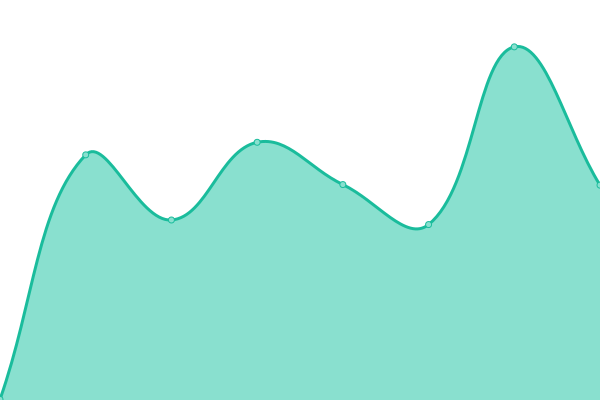
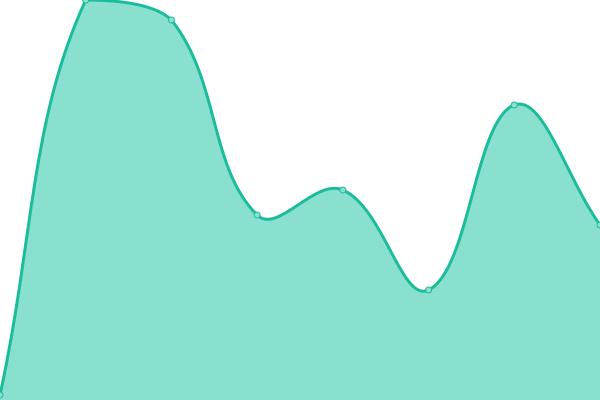
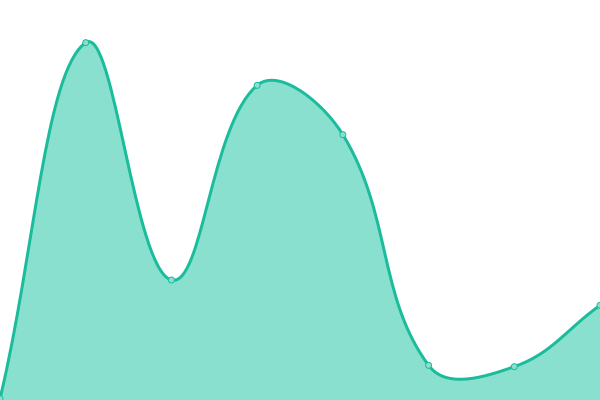

# [📈 Live Status](https://NetsBlox.github.io/uptime): <!--live status--> **🟩 All systems operational**

This repository contains the open-source uptime monitor and status page for [NetsBlox](https://netsblox.org/), powered by [Upptime](https://github.com/upptime/upptime).

With [Upptime](https://upptime.js.org), you can get your own unlimited and free uptime monitor and status page, powered entirely by a GitHub repository. We use [Issues](https://github.com/NetsBlox/uptime/issues) as incident reports, [Actions](https://github.com/NetsBlox/uptime/actions) as uptime monitors, and [Pages](https://NetsBlox.github.io/uptime) for the status page.

<!--start: status pages-->
<!-- This summary is generated by Upptime (https://github.com/upptime/upptime) -->
<!-- Do not edit this manually, your changes will be overwritten -->
<!-- prettier-ignore -->
| URL | Status | History | Response Time | Uptime |
| --- | ------ | ------- | ------------- | ------ |
|  [NetsBlox](https://netsblox.org) | 🟩 Up | [nets-blox.yml](https://github.com/NetsBlox/uptime/commits/HEAD/history/nets-blox.yml) | 

 242ms
     
 | 

<a href="https://NetsBlox.github.io/uptime/history/nets-blox">100.00%</a>
    

|  [NetsBlox Editor](https://editor.netsblox.org) | 🟩 Up | [nets-blox-editor.yml](https://github.com/NetsBlox/uptime/commits/HEAD/history/nets-blox-editor.yml) | 

 204ms
     
 | 

<a href="https://NetsBlox.github.io/uptime/history/nets-blox-editor">100.00%</a>
    

|  [NetsBlox Curriculum](https://curriculum.netsblox.org) | 🟩 Up | [nets-blox-curriculum.yml](https://github.com/NetsBlox/uptime/commits/HEAD/history/nets-blox-curriculum.yml) | 

 372ms
     
 | 

<a href="https://NetsBlox.github.io/uptime/history/nets-blox-curriculum">100.00%</a>
    

|  [NetsBlox Login Portal](https://login.netsblox.org) | 🟩 Up | [nets-blox-login-portal.yml](https://github.com/NetsBlox/uptime/commits/HEAD/history/nets-blox-login-portal.yml) | 

 39ms
     
 | 

<a href="https://NetsBlox.github.io/uptime/history/nets-blox-login-portal">100.00%</a>
    

|  [NetsBlox Documentation](https://editor.netsblox.org/docs) | 🟩 Up | [nets-blox-documentation.yml](https://github.com/NetsBlox/uptime/commits/HEAD/history/nets-blox-documentation.yml) | 

 149ms
     
 | 

<a href="https://NetsBlox.github.io/uptime/history/nets-blox-documentation">100.00%</a>
    

|  [RoboScape Online API](https://roboscapeonlineapi2.netsblox.org/server/status) | 🟩 Up | [robo-scape-online-api.yml](https://github.com/NetsBlox/uptime/commits/HEAD/history/robo-scape-online-api.yml) | 

 222ms
     
 | 

<a href="https://NetsBlox.github.io/uptime/history/robo-scape-online-api">100.00%</a>
    

<!--end: status pages-->

[**Visit our status website →**](https://NetsBlox.github.io/uptime)

## 📄 License

- Powered by: [Upptime](https://github.com/upptime/upptime)
- Code: [MIT](./LICENSE) © [NetsBlox](https://netsblox.org/)
- Data in the `./history` directory: [Open Database License](https://opendatacommons.org/licenses/odbl/1-0/)
